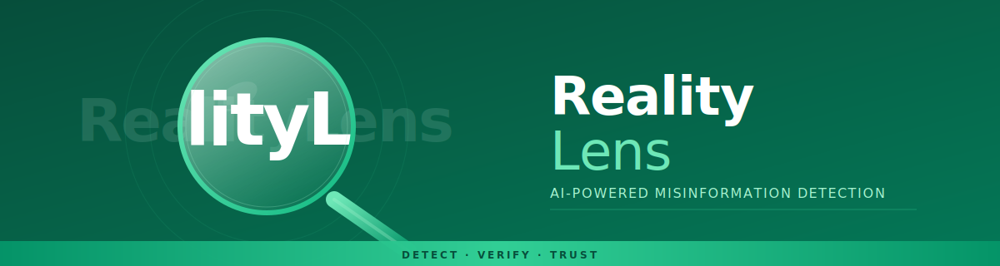
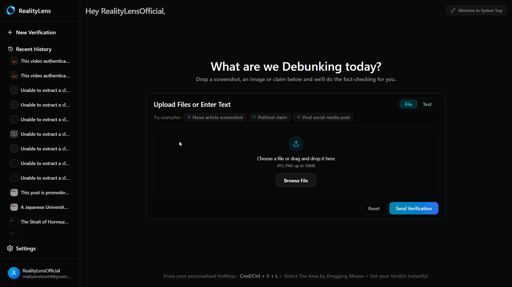
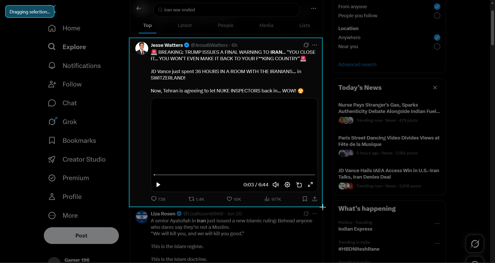
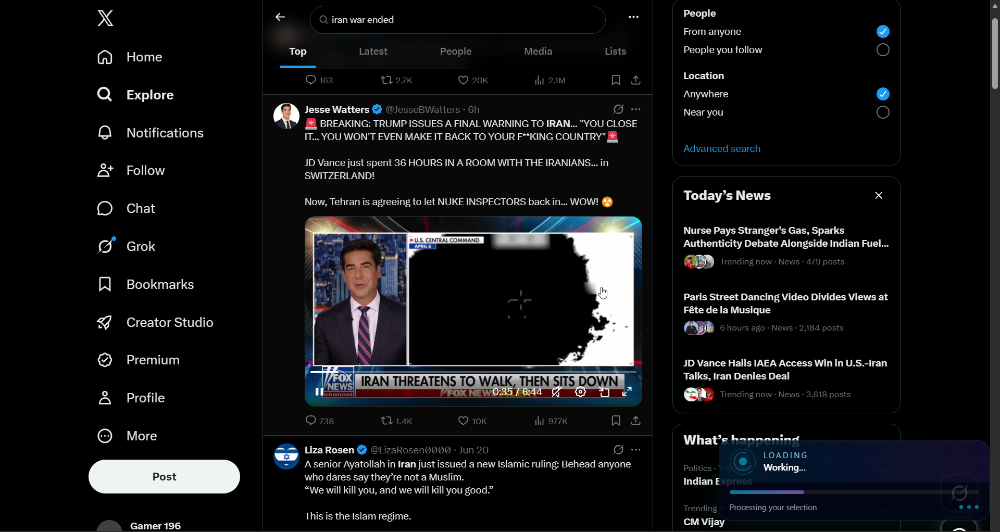
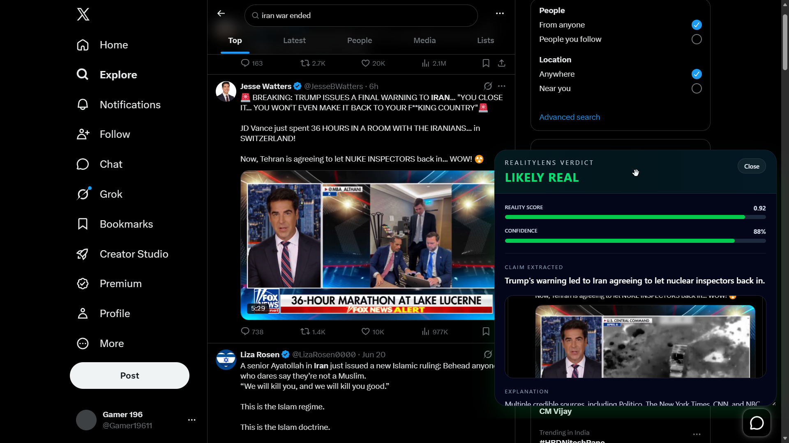
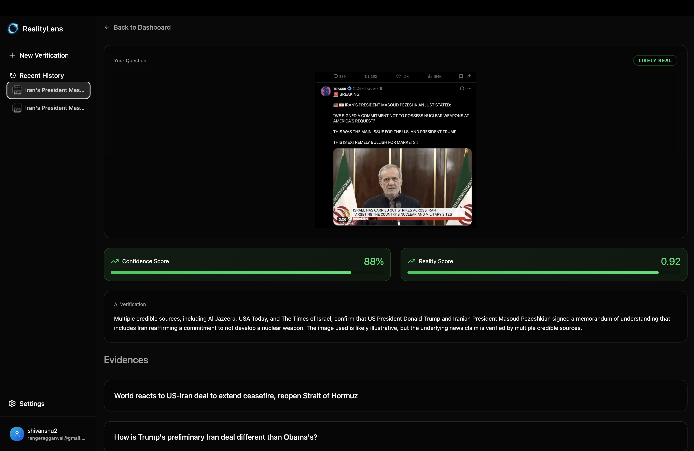

<div align="center">



<br/>

<!-- Primary badges — bright teal-to-sky palette, matches app UI -->


<br/>

<!-- AI model / tool badges -->


<br/>

<!-- CTA buttons -->
[](https://www.realitylens.in/)
[](https://github.com/shivanshumangal007-dev/realitylens-electron)
[](https://github.com/reyanshbhardwaj2005-spec/Reality-Lens-Android-Version.git)

<br/>

> ### *Every Post Tells a Story. Not Every Story Tells The Truth.*
> RealityLens captures any claim on your screen and runs it through a multi-model AI pipeline —
> returning a **Reality Score**, **Confidence Rating**, and **live evidence** in seconds, without breaking your flow.

<br/>

</div>

---

## ⚡ How It Works

```
  ┌──────────────────┐     ┌──────────────────┐     ┌──────────────────┐     ┌──────────────────┐     ┌──────────────────┐
  │  Global Hotkey   │────▶│  Screen Capture  │────▶│  Multi-Model AI  │────▶│  Web Evidence    │────▶│  Verdict Overlay │
  │  Ctrl+Shift+L    │     │  Drag to select  │     │ Groq·Gemini·Kimi │     │ Tavily + Image   │     │  Live on screen  │
  └──────────────────┘     └──────────────────┘     └──────────────────┘     └──────────────────┘     └──────────────────┘
```

---

## 🖥️ App Preview

> **Dashboard** — Drop a screenshot, image or text claim and send it for instant verification.



> **Overlay Popup** — Transparent selection overlay for capturing claims anywhere on your screen.



> **Loading Popup** — Processing the captured claim across our multi-model AI pipeline.



> **Result Popup** — Instant transparent overlay delivering the verdict right on your screen.



> **Verdict Result** — Full breakdown with Reality Score, Confidence, extracted claim, and live evidence sources.



---

## ✦ Core Capabilities

<table>
<tr>
<td width="50%">

### 🔍 Smart Screen Capture
Press `Ctrl/Cmd+Shift+L` from anywhere. A transparent overlay appears instantly — drag to select any region. Capture runs silently in the background without interrupting your workflow.

</td>
<td width="50%">

### 🧠 Multi-Model AI Pipeline
Groq, Gemini, and Cloudflare Kimi run in parallel, extracting and cross-validating every claim. More models means higher accuracy and fewer hallucinations.

</td>
</tr>
<tr>
<td width="50%">

### 🌐 Real-Time Web Verification
Every claim triggers a Tavily web search plus a reverse image lookup — surfacing live evidence from trusted sources that supports or contradicts the claim.

</td>
<td width="50%">

### 📊 Reality Score + Confidence
Results include a scored verdict (`LIKELY REAL` / `FALSE` / etc.), a 0–1 reality score, and a confidence percentage — shown directly on-screen via overlay.

</td>
</tr>
<tr>
<td width="50%">

### 🖥️ Native System Tray
Lives quietly in your menu bar. Closing the window keeps the global hotkey active. Supports launch on startup, minimize to tray, and single-instance locking.

</td>
<td width="50%">

### 🔐 Secure Auth & SSO
Email + OTP registration, Google Single Sign-On, deep-link protocol callbacks (`realitylens://`), and OTP-confirmed account deletion.

</td>
</tr>
<tr>
<td width="50%">

### 📁 Full Verification History
Every job is logged — thumbnail, extracted claim, verdict, and execution time. A nightly task auto-deletes records older than 10 days to save space.

</td>
<td width="50%">

### 🛡️ Rate Limiting & OTA Updates
Redis-backed rate limiting prevents abuse. `electron-updater` silently checks GitHub releases and prompts on new versions automatically.

</td>
</tr>
</table>

---

## 🏗️ Architecture

```
┌──────────────────────────────────────────┐       ┌──────────────────────────────────────────┐
│           ELECTRON DESKTOP APP           │       │              FASTAPI BACKEND             │
│                                          │       │                                          │
│   ┌──────────────┐   ┌────────────────┐  │       │   ┌─────────────┐   ┌─────────────────┐  │
│   │   React UI   │   │  Global Hotkey │  │       │   │  Auth API   │   │  Job Processor  │  │
│   │  Dashboard   │   │    Listener    │  │       │   │  OTP / SSO  │   │   (Async BG)    │  │
│   └──────┬───────┘   └───────┬────────┘  │       │   └─────────────┘   └────────┬────────┘  │
│          │                   │           │       │                               │          │
│   ┌──────▼───────────────────▼────────┐  │──────▶│   ┌───────────────────────────▼────────┐ │
│   │       Transparent Overlay         │  │       │   │      AI Orchestration Layer        │ │
│   │    Screenshot · Job Tracking      │  │       │   │    Groq  ·  Gemini  ·  Kimi        │ │
│   └───────────────────────────────────┘  │       │   └──────────────────┬─────────────────┘ │
│                                          │       │                      │                   │
│   ┌───────────────────────────────────┐  │       │   ┌──────────────────▼─────────────────┐ │
│   │  System Tray · Auto-Updater       │  │       │   │  Tavily Search · Image Search API  │ │
│   │  Startup · Single Instance Lock   │  │       │   │  Redis Rate Limiting · PostgreSQL  │ │
│   └───────────────────────────────────┘  │       │   └────────────────────────────────────┘ │
└──────────────────────────────────────────┘       └──────────────────────────────────────────┘
```

---

## 🧰 Tech Stack

| Layer | Technologies |
|:---|:---|
| **Desktop** | Electron, React, electron-updater, electron-log |
| **Backend** | FastAPI, Python, Redis, PostgreSQL |
| **AI Models** | Groq, Google Gemini, Cloudflare Kimi |
| **Search & Evidence** | Tavily Web Search, Parallel Reverse Image API |
| **Auth** | JWT, Google OAuth 2.0, Brevo OTP Email |
| **Infrastructure** | Async job queue, nightly data cleanup, Redis rate limiting |

---

## ✦ Feature Highlights

<details>
<summary><b>🔍 Verification Engine</b></summary>
<br/>

- **Screenshot Analysis** — global hotkey capture with transparent drag-to-select overlay
- **Text-Based Analysis** — submit any claim directly as text from the dashboard
- **Async Job Processing** — UI stays responsive while heavy AI tasks run in the background
- **Reality Score** — scored verdict with confidence, extracted claim, and explanation
- **Evidence Panel** — linked web sources supporting or contradicting every claim

</details>

<details>
<summary><b>🖥️ Native Desktop</b></summary>
<br/>

- **System Tray** — minimizes silently; hotkey stays active while the window is closed
- **Launch on Startup** — boots hidden in the background on system login
- **Single Instance Lock** — prevents accidental duplicate app windows
- **OS Optimizations** — hardware acceleration tuned per platform for glitch-free transparent overlays on video and games

</details>

<details>
<summary><b>👤 Authentication</b></summary>
<br/>

- Email + password registration and login
- 6-digit OTP verification via Brevo for registration, login, and sensitive profile changes
- Google Single Sign-On across desktop and web
- Custom deep-link protocol (`realitylens://`) for seamless browser auth callbacks
- OTP-confirmed account deletion for security

</details>

<details>
<summary><b>⚙️ Settings & Resilience</b></summary>
<br/>

- Customizable global hotkey via interactive in-app key recorder
- OTA auto-updates from GitHub Releases via `electron-updater`
- Persistent local crash and event logging via `electron-log`
- Graceful rate-limit fallback UI when API quota is exceeded
- React error boundaries prevent full app white-screens on component failures

</details>

---

<div align="center">

<br/>

*Every Post Tells a Story. Not Every Story Tells The Truth.*

<br/>

[](https://www.realitylens.in/)&nbsp;&nbsp;
[](https://github.com/shivanshumangal007-dev/realitylens-electron)
[](https://github.com/reyanshbhardwaj2005-spec/Reality-Lens-Android-Version.git)

<br/>

<!-- Footer: Cylinder style — closed lens ring gradient, matching header -->


</div>
