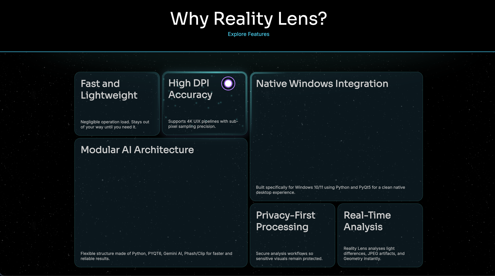

<div align="center">

<!-- Animated Header -->


<!-- Badges -->
<br/>


<br/>


<br/>

[](https://www.realitylens.in/)&nbsp;&nbsp;[](https://github.com/shivanshumangal007-dev/realitylens-electron)
 
<br/><br/>

> **Press `Ctrl+Shift+L`. Select a region. Get the truth.**  
> RealityLens captures any claim on your screen and runs it through a multi-model AI pipeline  
> to deliver a live fact-check verdict — without breaking your flow.

<br/>

</div>

---

## ✦ How It Works

```
  [ Global Hotkey ]  →  [ Screen Capture ]  →  [ Multi-Model AI ]  →  [ Web Evidence ]  →  [ Verdict Overlay ]
   Ctrl + Shift + L     Transparent select     Groq · Gemini · Kimi    Tavily + Image        Live on screen
```

---
## 🌠 Glimpse into Reality Lens

<div align="center">
  
  <br/><br/>
  
</div>

---
## ⚡ Core Capabilities

<table>
<tr>
<td width="50%">

### 🔍 Smart Screen Capture
A system-wide hotkey launches a transparent overlay. Click and drag to select any region — the app captures it silently in the background without interrupting your workflow.

</td>
<td width="50%">

### 🧠 Multi-Model AI Pipeline
Three AI models run in parallel — Groq, Gemini, and Cloudflare Kimi — extracting claims and cross-validating them against each other for higher accuracy.

</td>
</tr>
<tr>
<td width="50%">

### 🌐 Real-Time Web Verification
Every claim triggers a Tavily web search and a parallel reverse image lookup, surfacing live supporting or contradicting evidence from across the web.

</td>
<td width="50%">

### 📊 Verdict with Score & Confidence
Results include a **reality score (0–100)** and a **confidence level**, delivered directly in an overlay on your screen — no tab switching, no context loss.

</td>
</tr>
<tr>
<td width="50%">

### 🖥️ Native System Tray Integration
RealityLens lives quietly in your menu bar. Closing the window keeps the hotkey active. Launch on startup, minimize to tray, single-instance locked.

</td>
<td width="50%">

### 🔐 Secure Authentication
Email + OTP registration, Google SSO, deep-link protocol callbacks (`realitylens://`), and OTP-gated account deletion — all covered.

</td>
</tr>
<tr>
<td width="50%">

### 📁 Full Verification History
Every analysis is logged: thumbnail preview, extracted claim, verdict, and execution time. A nightly cleanup auto-removes records older than 10 days.

</td>
<td width="50%">

### 🛡️ Rate Limiting & Auto-Updates
Redis-backed rate limiting prevents abuse. Built-in OTA updates via `electron-updater` check GitHub releases and prompt the user automatically.

</td>
</tr>
</table>

---

## 🎯 Live Verdict Example

```
┌─────────────────────────────────────────────────────────────┐
│  ● ● ●   REALITYLENS OVERLAY                                │
├─────────────────────────────────────────────────────────────┤
│                                                             │
│  Claim: "5G towers disrupt bird migration via cellular      │
│          interference — scientists confirm."                │
│                                                             │
│  Reality Score   ████░░░░░░░░░░░░░░░░░░   12 / 100          │
│  Confidence      ████████████████████░░   94%               │
│                                                             │
│  ● FALSE — No peer-reviewed evidence found                  │
│                                                             │
└─────────────────────────────────────────────────────────────┘
```

---

## 🏗️ Architecture

```
┌─────────────────────────────────────┐     ┌────────────────────────────────────┐
│         ELECTRON DESKTOP APP        │     │           FASTAPI BACKEND          │
│                                     │     │                                    │
│  ┌─────────────┐  ┌──────────────┐  │     │  ┌──────────┐  ┌───────────────┐   │
│  │  React UI   │  │ Global Hotkey│  │     │  │ Auth API │  │  Job Processor│   │
│  │  Dashboard  │  │   Listener   │  │     │  │ OTP/SSO  │  │  (Async BG)   │   │
│  └──────┬──────┘  └──────┬───────┘  │     │  └──────────┘  └───────┬───────┘   │
│         │                │          │     │                         │          │
│  ┌──────▼──────────────▼─────────┐  │ ──► │  ┌───────────────────▼────────┐    │
│  │     Transparent Overlay       │  │     │  │   AI Orchestration Layer   │    │
│  │   (Screenshot + Job Track)    │  │     │  │  Groq · Gemini · Kimi      │    │
│  └───────────────────────────────┘  │     │  └────────────┬───────────────┘    │
│                                     │     │               │                    │
│  ┌──────────────────────────────┐   │     │  ┌────────────▼───────────────┐    │
│  │  System Tray · Auto-Updater  │   │     │  │  Tavily Search · Image API │    │
│  │  Startup · Single Instance   │   │     │  │  Redis Rate Limit · DB     │    │
│  └──────────────────────────────┘   │     │  └────────────────────────────┘    │
└─────────────────────────────────────┘     └────────────────────────────────────┘
```

---

## 🧰 Tech Stack

| Layer | Technologies |
|---|---|
| **Desktop** | Electron, React, electron-updater, electron-log |
| **Backend** | FastAPI, Python, Redis, PostgreSQL |
| **AI Models** | Groq, Google Gemini, Cloudflare Kimi |
| **Search** | Tavily Web Search, Parallel Image Search API |
| **Auth** | JWT, Google OAuth 2.0, Brevo OTP |
| **Infrastructure** | Background job queue, nightly data cleanup, rate limiting |

---

## ✦ Feature Highlights

<details>
<summary><b>🔍 Verification Engine</b></summary>

- **Screenshot Analysis** — hotkey-triggered capture with transparent region selector
- **Text-Based Analysis** — submit any claim directly as text from the dashboard
- **Async Job Processing** — UI stays responsive while AI runs in the background
- **Reality Score** — 0–100 score with confidence level and detailed breakdown

</details>

<details>
<summary><b>🖥️ Native Desktop</b></summary>

- **System Tray** — minimizes to tray; hotkey stays active always
- **Launch on Startup** — boots silently in the background
- **Single Instance Lock** — no duplicate app windows
- **OS Optimizations** — hardware acceleration tuned per platform for glitch-free overlays

</details>

<details>
<summary><b>👤 Authentication</b></summary>

- Email + password registration and login
- 6-digit OTP email verification via Brevo
- Google Single Sign-On across desktop and web
- Custom deep-link protocol (`realitylens://`) for auth callbacks
- OTP-confirmed account deletion

</details>

<details>
<summary><b>⚙️ Settings & Resilience</b></summary>

- Customizable global hotkey via interactive key recorder
- OTA auto-updates from GitHub releases
- Persistent local logging via `electron-log`
- Rate limiting screen with graceful fallback UI
- React error boundaries to prevent full app crashes

</details>

---

<div align="center">

<br/>
**Don't believe everything you see. Let the machine check.**

 
<br/>

</div>